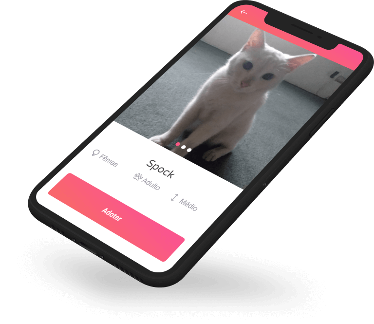
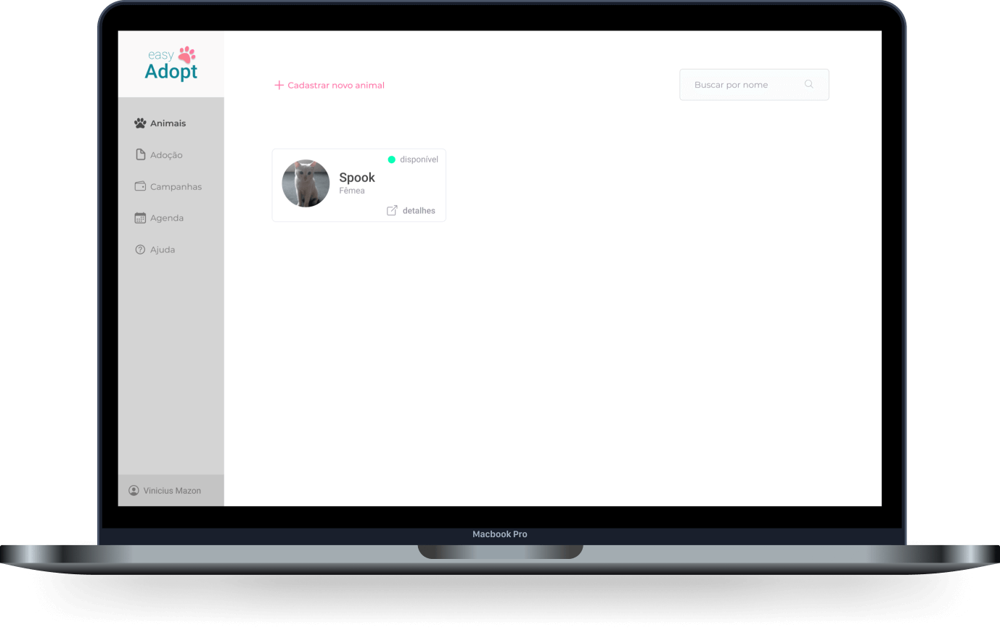

<h1 align="center">
    
</h1>

<p align="center">
  <a href="#-sobre-o-projeto">Sobre o projeto</a>&nbsp;&nbsp;&nbsp;|&nbsp;&nbsp;&nbsp;
  <a href="#-tecnologias">Tecnologias</a>&nbsp;&nbsp;&nbsp;|&nbsp;&nbsp;&nbsp;
  <a href="#-como-utilizar">Como utilizar</a>&nbsp;&nbsp;&nbsp;|&nbsp;&nbsp;&nbsp;
  <a href="#-como-contribuir">Como contribuir</a>&nbsp;&nbsp;&nbsp;|&nbsp;&nbsp;&nbsp;
  <a href="#-licença">Licença</a>
</p>
<div align="center">
    <a href="https://github.com/ViniciusMazon/easy-adopt/issues"></a>
    <a href="https://github.com/ViniciusMazon/easy-adopt/blob/main/LICENSE"></a>
</div>


<p align="center">
  
</p>

# 💡 Sobre o projeto
Criado como Trabalho de Conclusão do Curso de Engenharia de Software, UNICESUMAR.

O easyAdopt é um sistema destinado a ONGs de animais. Atua auxiliando o gerenciamento e a divulgação dos animais, bem como, dos pedidos de adoção e campanhas de doações.

O sistema é composto por uma SPA destinada às ONGs e por um App mobile destinado aos usuários que tenham o ensejo de adotar um animal.


## ▶️ Vídeo demo das principais features
* [Cadastro de animal e procedimento - 47 segundos](https://www.youtube.com/watch?v=bYEaO50kRjQ&feature=youtu.be)

* [Adoção - 2 minutos](https://www.youtube.com/watch?v=IwmIfQc0QXI&feature=youtu.be)

* [Criação de campanha e doação - 1 minuto](https://www.youtube.com/watch?v=CMdIdes7jBU&feature=youtu.be)

  

  <p align="center">
    
  </p>


<table  align="center">
  <tr style="display: flex; align-items: center; justify-content: center; flex-direction: row;">
    <td style="display: flex; align-items: center; justify-content: center; flex-direction: row;  margin-right: 30px;  border: 1px solid black;">
      
      <div style="display: flex; align-items: center; justify-content: center; flex-direction: column; margin: 0 10px;">
        <p>Aluno: Vinicius P. Mazon</p>
        <p>
            <a href="https://www.linkedin.com/in/vmazon/">LinkedIn</a>
        </p></div>
    </td>
    <td style="display: flex; align-items: center; justify-content: center; flex-direction: row;  margin-right: 30px;  border: 1px solid black;">
      
      <div style="display: flex; align-items: center; justify-content: center; flex-direction: column; margin: 0 10px;">
        <p>Orientador: Prof. Me. Erinaldo Sanches Nascimento</p>
        <p>
            <a
            href="https://www.linkedin.com/in/erinaldo-sanches-nascimento-925a4938/"
            >LinkedIn</a>
        </p></div>
    </td>
  </tr>
</table>


# 🔬 Tecnologias

* [NodeJs](https://nodejs.org/en/)
* [ReactJs](https://reactjs.org)
* [React Native](https://reactnative.dev)
* [Expo](https://expo.io)
* [Docker](https://www.docker.com)

# ⚙️ Como utilizar

Clone o repositório:

```bash
git clone https://github.com/ViniciusMazon/easy-adopt.git
```

Instale as dependência rodando, individualmente em cada diretório (api, web e mobile), o comando:

```
yarn
```

Dentro do diretório ./api, suba o container rodando:

```bash
docker-compose up -d
```

Crie as migrations rodando, dentro do diretório ./api, o script:

```bash
yarn knex:migrate
```

Para criar as seeds, utilize o script:

```
yarn knex:seed
```

No diretório ./mobile/services, edite o arquivo api.js e adicione o IP da sua máquina seguindo o exemplo abaixo:

```javascript
const api = axios.create({
  baseURL: 'http://SEUIP:3333',
});
```

Rode o projeto utilizando os scripts: 

./api

```
yarn dev
```

./web e ./mobile

```
yarn start
```

Para desenvolver utilizando seu celular, instale o aplicativo do Expo em [Expo Google Play](https://play.google.com/store/apps/details?id=host.exp.exponent&hl=pt_BR) e digitalize o QR Code exibido.

Rode os testes na API utilizando o script:

```
yarn test
```

# 🖖🏻 Como contribuir

- Faça um fork desse repositório;
- Clone esse repositório em sua máquina: `https://github.com/ViniciusMazon/easy-adopt.git`
- Cria uma branch com a sua feature: `git checkout -b minha-feature`;
- Faça o commit dos testes: `git commit -m 'test(api): Nome do teste'`;
- Faça commit das suas alterações: `git commit -m 'feat(web, mobile ou api): Minha nova feature'`;
- Faça push para a sua branch: `git push origin minha-feature`.

Depois que o merge da sua pull request for feito, você pode deletar a sua branch.

# 📃 Licença

Esse projeto está sob a licença MIT. Veja o arquivo LICENSE para mais detalhes.

---

Feito com 🖤 por Vinicius Mazon.


