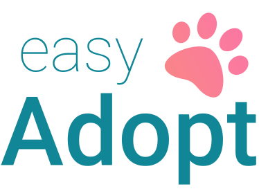

# 💡 Sobre o projeto





Criado como Trabalho de Conclusão do Curso de Engenharia de Software.

O Easy Adopt é um sistema de adoção e gerenciamento de animais para ONGs. Atuando em duas frentes, uma por meio do aplicativo destinado aos usuários que desejam adotar um animal, possibilitando a divulgação dos animais disponíveis e que pedidos de adoção, agendamentos de visitas e doações sejam otimizados. A outra frente é por meio da SPA destinada a ONG que passará a administrar seus animais por meio de registros online, que eliminará a necessidade de manter registros físicos e permitirá que a geração de relatórios para decisão estratégica como compra de rações e de insumos para o tratamento dos animais seja feito mais facilmente. 


# 🔬 Tecnologias

* NodeJs
* ReactJs
* React Native


# ⚙️ Como utilizar

Clone o repositório:

```bash
git clone https://github.com/ViniciusMazon/easy-adopt.git
```

Instale as dependências:

```bash
yarn
```

Rode utilizando o script

```bash
yarn start
```


# 🖖🏻 Como contribuir

- Faça um fork desse repositório;
- Clone esse repositório em sua máquina: `https://github.com/ViniciusMazon/easy-adopt.git`
- Cria uma branch com a sua feature: `git checkout -b minha-feature`;
- Faça commit das suas alterações: `git commit -m 'feat: Minha nova feature'`;
- Faça push para a sua branch: `git push origin minha-feature`.

Depois que o merge da sua pull request for feito, você pode deletar a sua branch.


# 📃 Licença

Esse projeto está sob a licença MIT. Veja o arquivo LICENSE para mais detalhes.
